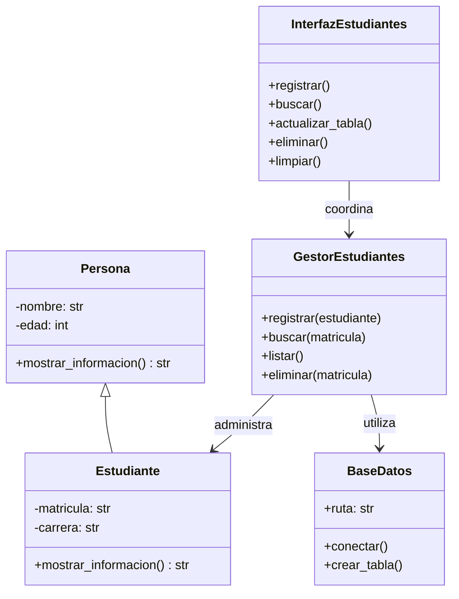

# Diagrama UML de clases
Puedes visualizar este código Mermaid en GitHub o en un editor compatible.

```mermaid
classDiagram
    Persona <|-- Estudiante
    GestorEstudiantes --> Estudiante : administra
    GestorEstudiantes --> BaseDatos : utiliza
    InterfazEstudiantes --> GestorEstudiantes : coordina
    class Persona {
        -nombre: str
        -edad: int
        +mostrar_informacion() str
    }
    class Estudiante {
        -matricula: str
        -carrera: str
        +mostrar_informacion() str
    }
    class BaseDatos {
        +ruta: str
        +conectar()
        +crear_tabla()
    }
    class GestorEstudiantes {
        +registrar(estudiante)
        +buscar(matricula)
        +listar()
        +eliminar(matricula)
    }
    class InterfazEstudiantes {
        +registrar()
        +buscar()
        +actualizar_tabla()
        +eliminar()
        +limpiar()
    }
```
